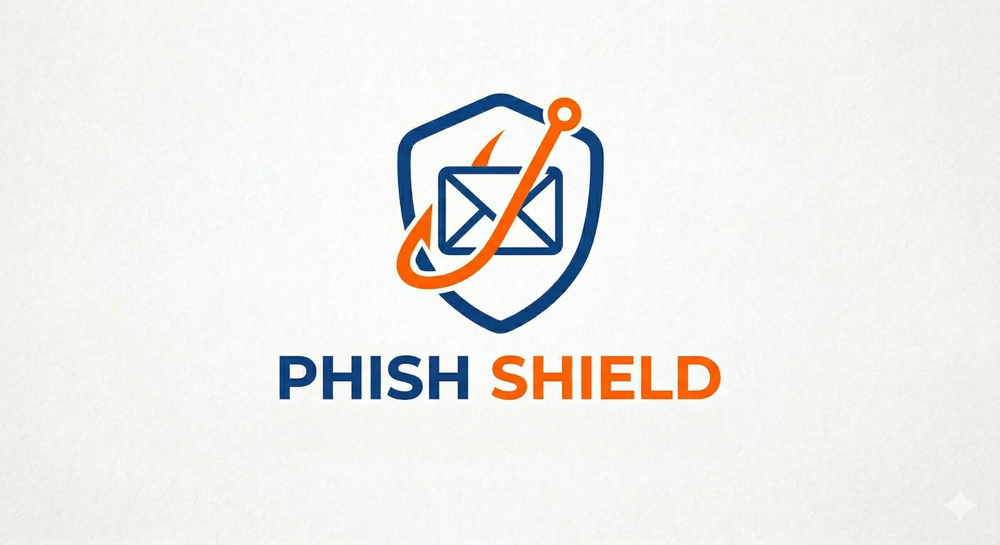

# 🛡️ PhishShield — AI-Powered Phishing Email Detector



**Real-time phishing detection in Gmail & Outlook using RAG + Agentic AI + Chrome Extension**


---

## ✨ Features

- **Real-time Email Analysis** — Works directly inside Gmail and Outlook
- **Advanced AI Detection** — Combines keyword analysis, suspicious link detection, and **RAG (Retrieval-Augmented Generation)**
- **Agentic Decision Engine** — Smart decision tree + Explainable AI (XAI) explanations
- **Beautiful UI** — Animated risk gauge, inline warning banner, and toolbar badge
- **Scan History Dashboard** — Full history with stats and detailed explanations
- **Watermark Effect** — Professional branding on dashboard
- **Privacy-First** — All analysis runs locally or on your own server

---

## 🚀 Quick Start

### 1. Backend Setup

```bash
# Clone the repo
git clone https://github.com/yourusername/phishshield.git
cd phishshield/backend

# Create virtual environment (Python 3.11+ recommended)
python -m venv venv

# Activate virtual environment
# Windows (PowerShell)
.\venv\Scripts\Activate
# Windows (Git Bash)
source venv/Scripts/activate

# Install dependencies
pip install -r requirements.txt

# Start the server
uvicorn main:app --reload --port 8000